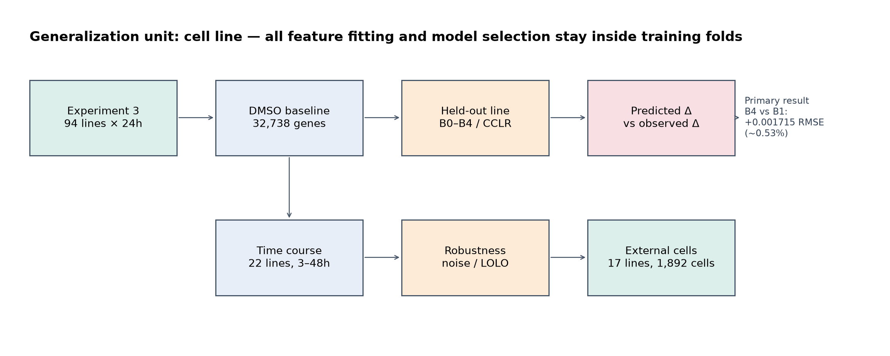
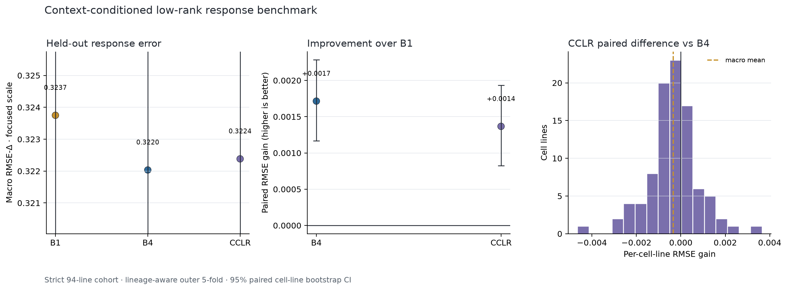
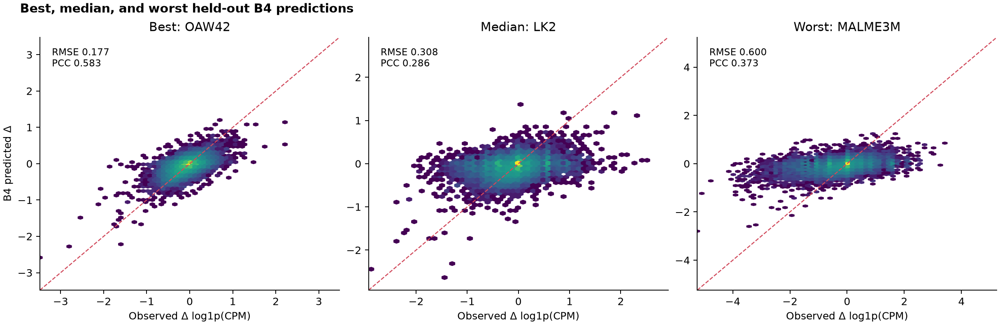
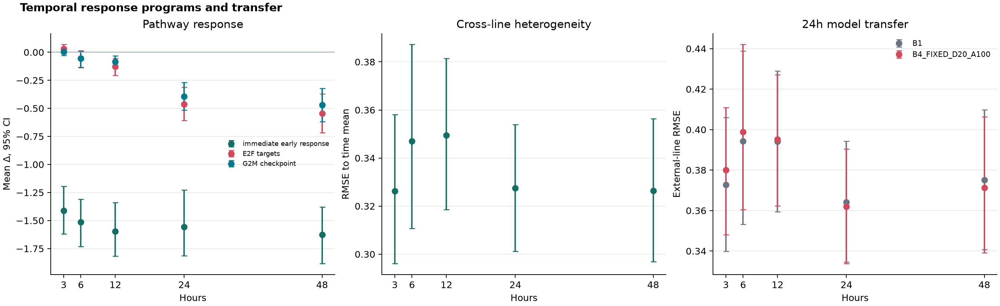
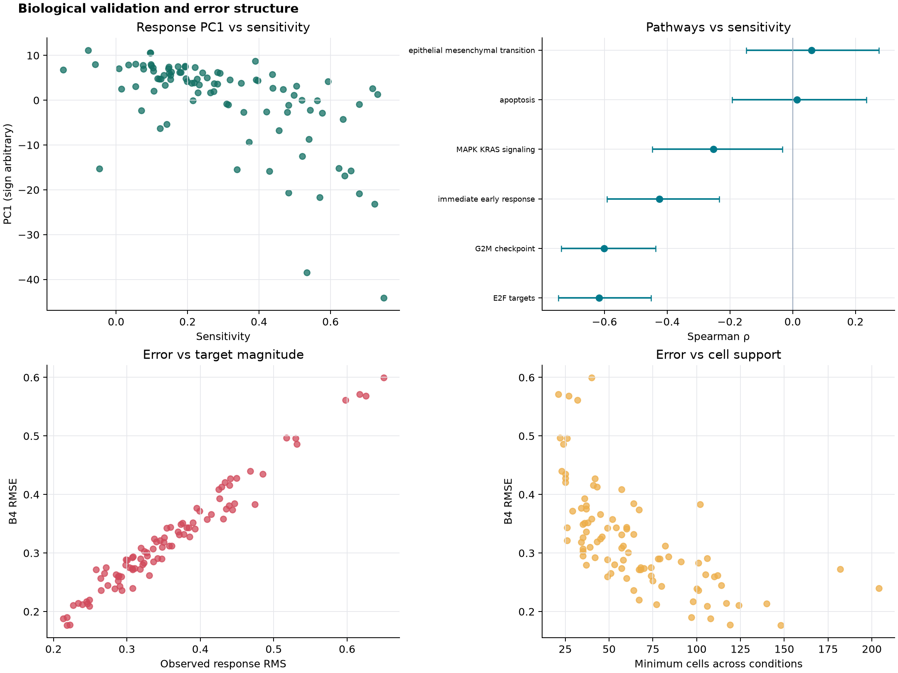
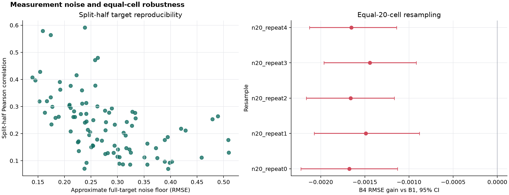
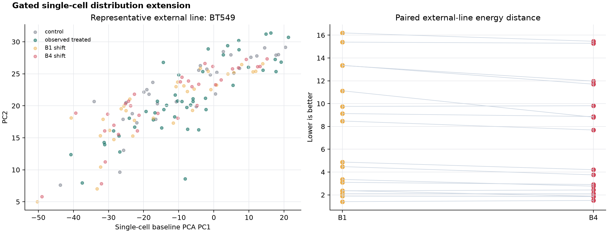

# Predicting Context-Dependent Transcriptional Responses to MEK Inhibition across Cancer Cell Lines

## 암세포주의 초기 전사 상태로부터 trametinib 반응을 예측하는 저차원 통계 모델

작성일: 2026-08-27

Release: 1.0.0

분석 parent commit: `7bd38c61bc4220a35483c47b17168c57aecd3380`

## Technical Summary

94개 암세포주에서 동시에 측정된 24시간 vehicle-control(DMSO) 전사 상태를 입력으로 사용해, 보지 못한 세포주의 `trametinib 24h − DMSO 24h` 32,738-gene 반응을 예측했다. 모든 feature 선택, PCA, response basis와 hyperparameter 선택은 cell-line outer test fold 밖에서 수행했다.

핵심 결과는 **baseline context가 global mean을 넘어서는 추가 정보를 제공하지만, 그 예측 이득은 작고 sampling-sensitive하다**는 것이다. B1 global mean RMSE는 `0.323750`, B4 direct ridge RMSE는 `0.322035`였다. 같은 held-out line을 짝지은 개선은 `0.001715` (95% CI `0.001168–0.002284`), 상대적으로 약 `0.53%`다. B4의 residual-context PCC는 `0.107666`이었다. 통계적 방향은 검출되지만 강한 개인화 예측으로 부르기에는 부족하다.

명시적 low-rank response 모델 CCLR은 B1을 `0.001367` 개선했으나 B4보다 `0.000348` 나빴다. 20-cell 균등 subsampling에서는 B4 gain이 5회 모두 음수가 됐고, leave-one-lineage-out 결과도 불확실했다. 반면 threshold와 gene-filter 변화에는 작은 양의 gain이 유지됐다. 생물학적으로는 response PC1, E2F/G2M, immediate-early 반응이 trametinib sensitivity와 연관됐지만 이 분석은 관찰적이다.



## Key Findings

1. **평균 약물 반응이 대부분을 설명한다.** B0 no-change RMSE `0.355870`에서 B1 global mean은 `0.323750`으로 크게 개선됐다.
2. **Baseline context의 추가 신호는 작게 검출된다.** B4는 B1보다 RMSE `0.001715` 개선했고 95% CI가 0을 넘었다. B4 PCC-context는 `0.107666`이었다.
3. **복잡도를 더한 CCLR은 B4를 넘지 못했다.** CCLR RMSE `0.322383`, B4 대비 gain `-0.000348` (95% CI `-0.000584–-0.000105`)였다.
4. **Lineage 평균과 최근접 이웃은 충분하지 않았다.** B2 RMSE `0.350623`, B3 RMSE `0.429705`로 둘 다 B1보다 나빴다.
5. **시간적 전이는 24시간 근처에 국한됐다.** 외부 17-line 전이에서 B4는 3h/6h에 B1보다 나빴고, 12h에는 차이가 불확실하며, 24h와 48h에만 작게 개선됐다.
6. **오차는 반응 크기와 표본 수에 강하게 연결됐다.** B4 RMSE와 response RMS의 Spearman `ρ=0.972806`, 최소 조건 cell 수와는 `ρ=-0.774982`였다. Baseline novelty와는 연관이 없었다 (`ρ=0.033371`).
7. **결론의 가장 큰 취약점은 cell sampling이다.** 20-cell 균등 subsampling 5/5에서 B4 gain이 음수였고 split-half full-target noise floor는 약 `0.279028`이었다.



## Scope, Data, and Metrics

원자료는 McFarland et al.의 MIX-seq experiment 3와 time-course 자료다.[^1] 주 분석은 `cell_quality == normal`이고 24h DMSO와 trametinib 양쪽에 각각 20개 이상의 세포가 있는 94개 line이다. 이 코호트에는 총 16,588개 normal cell이 포함된다. 저자 분석을 재현하는 pooled-control 민감도 코호트는 97 lines, 25,130 cells이며 주 분석과 분리했다.

각 세포주·조건에서 UMI를 합산하고 CPM으로 정규화한 뒤 `log1p`를 적용했다. 반응은 다음과 같다.

```text
delta(line) = log1p_CPM(trametinib, 24h) - log1p_CPM(DMSO, 24h)
```

주 지표는 세포 수 가중치가 없는 cell-line macro RMSE다. 보조 지표는 NRMSE, gene-wise PCC/Spearman, signed top-50 overlap과 B1 residual을 대상으로 한 PCC-context다. 모든 모델 차이는 동일 held-out line의 paired difference이며, 2,000회 cell-line bootstrap percentile 95% CI를 보고한다.

중요하게도 DMSO는 각 세포주의 약물 처리 전 동일 세포를 추적한 pre-treatment가 아니라, 같은 실험에서 동시에 측정한 별도의 vehicle-control cell population이다.

## Methodology and Model Specification

### Leakage-safe validation

일반화 단위는 cell이 아니라 cell line이다. Lineage-aware outer 5-fold에서 각 line은 정확히 한 번 test가 된다. B3/B4/CCLR의 variable-gene filter, scaling, PCA, response PCA와 ridge hyperparameter는 outer-training 또는 그 내부 4-fold에서만 fit했다. Trametinib sensitivity와 BRAF/KRAS mutation은 해석에만 사용하고 predictor에는 넣지 않았다.

### B0–B4 baselines

- B0: zero response
- B1: outer-training line의 평균 response
- B2: training line 중 같은 lineage의 평균 response; 표본 부족 시 B1 fallback
- B3: training-only control PCA에서 가장 가까운 line의 response
- B4: training-only control PCA score에서 전체 response vector로 가는 multi-output ridge

B4는 평균 `log1p(CPM) ≥ 0.1`이고 nonzero variance인 training genes 중 분산 상위 5,000개를 사용한다. Whitened PCA dimension `[5,10,20,30]`과 ridge alpha `[0.01,0.1,1,10,100]`을 nested CV로 고른다.

### CCLR

CCLR은 control PCA에서 response-PC score를 예측하고, training response basis로 32,738-gene response를 복원한다.

```text
DMSO → control PCA → ridge → response-PC scores → reconstructed delta
```

Response rank `[2,5,10,20]`까지 nested CV로 선택했다. 모든 fold가 rank 20과 alpha 100을 골랐지만, 결과를 본 뒤 W6 grid를 변경하지 않고 W7의 사전 고정 진단으로 분리했다.

## Results

### W5–W7: held-out benchmark, CCLR, and ablations

| Model | RMSE | PCC-delta | PCC-context | RMSE gain vs B1 |
|---|---:|---:|---:|---:|
| B0 no-change | 0.355870 | NA | 0.047613 | -0.032120 |
| B1 global mean | 0.323750 | 0.420086 | NA | 0 |
| B2 lineage mean | 0.350623 | 0.345552 | 0.064597 | -0.026874 |
| B3 nearest line | 0.429705 | 0.247164 | 0.058568 | -0.105955 |
| **B4 direct ridge** | **0.322035** | **0.428001** | **0.107666** | **0.001715** |
| CCLR | 0.322383 | 0.425501 | 0.096521 | 0.001367 |

W7의 fixed d20/r20, pathway, lineage, BRAF/KRAS 변형은 모두 B1보다 나았지만 B4를 확실히 넘지 못했다. B4의 direct mapping이 이 데이터 규모에서 가장 단순하고 좋은 주 모델로 남았다. Fold response-subspace의 mean squared cosine은 평균 `0.676`으로, 상위 구조는 공유되지만 전체 basis가 안정적이라고 보기는 어렵다.



### W8: temporal response and transfer

Time-course clean hashtag data는 24 lines, 13,713 cells였다. 각 조건·시점 10-cell 기준을 만족한 22 lines에서 immediate-early response는 3h부터 48h까지 강하게 음수였고, E2F/G2M 억제는 12h부터 분명해져 24–48h에 커졌다. Early 대비 late cross-line heterogeneity 증가는 관찰되지 않았다: difference `-0.009666`, 95% CI `-0.0342–0.0121`.

Core와 겹치지 않는 외부 17 lines에 24h fixed model을 전이한 B4 gain은 3h `-0.007310`, 6h `-0.004712`, 12h `-0.001242` (CI includes 0), 24h `0.002074`, 48h `0.003839`였다. 즉 24h 모델은 초기 반응 예측기로 일반화되지 않았다.



### W9: biological associations and error structure

38개 사전 정의/탐색 검정 중 22개가 BH-FDR 0.05 미만이었다. Response PC1과 trametinib sensitivity의 Spearman은 `-0.668273`; E2F `-0.617108`, G2M `-0.601835`, immediate-early response `-0.424831`이었다. PCA 부호는 임의이므로 PC1 방향 자체보다 연관의 크기와 재현 가능한 표식을 해석했다.

오류는 baseline novelty보다 관측 response magnitude와 cell support에 의해 훨씬 잘 설명됐다. 두 변수를 서로 보정한 partial Spearman도 response RMS `0.953481`, min cells `-0.568730`으로 남았다. 이는 모델이 낯선 baseline 때문에만 실패한 것이 아니라, 큰 반응과 작은 세포 표본에서 측정·예측 오차가 함께 커졌음을 뜻한다.



### W10: robustness and measurement floor

양의 B4 gain은 bootstrap seed 3개, inclusion threshold 10/20/30, variable-gene filter 1k/3k/5k/10k, sensitivity 양극단 제거에서 유지됐다. 그러나 다음 두 검사는 결론의 경계를 정했다.

- Equal-20-cell subsampling: gain `-0.001443`에서 `-0.001677`; 5/5 CI가 0 아래
- Leave-one-lineage-out: gain `0.000514`, 95% CI `-0.000132–0.001178`

Split-half에서 추정한 full-target noise floor `0.279028`은 B4 RMSE `0.322035`에 가깝고, split-half PCC는 `0.236373`이었다. 모델 비교의 작은 차이를 측정 정밀도와 분리해 과도하게 해석해서는 안 된다.



### W11: gated single-cell distribution extension

사전 gate를 통과해 17 external lines, 1,892 cells에서 제한적 분포 분석을 수행했다. B1 대비 B4는 Energy distance를 `0.570597` (95% CI `0.294577–0.904828`), sliced-Wasserstein을 `0.163040` (95% CI `0.087361–0.245814`) 개선했다. No-change보다 mean response translation이 훨씬 중요했고, context shift가 이를 조금 더 개선했다.

이 결과는 모든 control cell에 동일한 predicted latent shift를 더한 위치 이동 검사다. Cell-to-cell covariance나 shape를 바꾸지 않으며 paired trajectory, cell fate, cell-specific state prediction을 뜻하지 않는다. W11은 model selection에 사용하지 않았다.



## Validation and Reproducibility

각 단계는 별도 validator로 독립 metric 재계산, prediction reconstruction, cohort/split overlap, training-only feature contract와 checksum을 검사했다. W6–W11 validator가 모두 통과했고, W12 release는 B0–B4/CCLR 각 94-line prediction, 64 final metrics, 94 final cell-line rows, 10 figures와 6 tables를 manifest로 동결했다.

핵심 동결 checksum은 다음과 같다.

| Artifact | SHA-256 |
|---|---|
| `final_predictions.parquet` | `5ffe460c0a3019fa6369d483fa6dfd2ec771494e472418ab401303c555ee6562` |
| `final_metrics.csv` | `bd1c448709a69b3858f0d91451615e8ed129f26450f574917a7df69297ab281f` |
| `final_cell_lines.csv` | `4fd26f2484a62027ac184759b1b71ecb9e23d91a0716aa6d3e73891af78027ed` |

재현 명령과 단계별 산출물은 `../docs/reproduction_checklist.md`와 `supplementary.md`에 기록한다.

## Limitations and Uncertainty

가장 중요한 제한은 효과 크기, cell sampling, measurement floor다. 또한 time-course는 source/batch가 다르고 external line 수가 작다. Sensitivity·lineage·mutation 연관은 인과적이지 않으며 independent biological replicate가 제한적이다. W11은 분포 모양 예측이 아니라 latent mean translation이다. 전체 주장 경계는 `limitations.md`에 고정했다.

## Conclusions

Leakage-safe held-out-cell-line 평가에서 baseline 전사 상태는 global mean response를 넘어서는 작고 해석 가능한 신호를 제공했다. 그러나 B4의 상대 RMSE 개선은 약 `0.53%`였고, equal-cell subsampling에서 방향이 뒤집혔다. 따라서 이 연구는 **context signal의 존재**는 지지하지만 **강한 개인화 예측의 실현**은 지지하지 않는다. 다음 성능 도약은 더 복잡한 저차원 모델보다 biological replicate와 cell support를 늘리고, 독립 실험에서 같은 cell line을 다시 측정하는 데서 먼저 찾아야 한다.

## Recommended Next Steps

1. 각 line/condition의 cell 수를 50개 이상으로 균형화한 독립 replicate를 확보한다.
2. 동일 source에서 3–48h control/trametinib을 다시 측정해 time과 batch를 분리한다.
3. 주 평가를 replicate-held-out과 cell-line-held-out의 이중 일반화로 확장한다.
4. 충분한 반복이 생긴 뒤 heteroscedastic 또는 measurement-error-aware ridge를 비교한다.
5. Single-cell shape 예측은 cell-level likelihood와 covariance-changing model을 명시하고 W11 mean-shift 기준선보다 평가한다.

## Further Questions

- 20-cell subsampling에서 context gain이 사라지는 원인은 baseline feature noise인가, response target noise인가?
- 특정 pathway나 고신뢰 유전자 집합에서는 전체 32,738-gene RMSE보다 더 큰 실용적 gain이 있는가?
- Replicate-aware shrinkage가 큰 반응을 가진 low-support line의 오차를 줄일 수 있는가?
- 24h 이후의 작은 transfer gain이 진짜 생물학적 지속성인지 source-specific calibration인지 독립 데이터에서 재현되는가?

[^1]: McFarland JM et al. Multiplexed single-cell transcriptional response profiling to define cancer vulnerabilities and therapeutic mechanism of action. *Nature Communications*. 2020;11:4296. doi:10.1038/s41467-020-17440-w.
